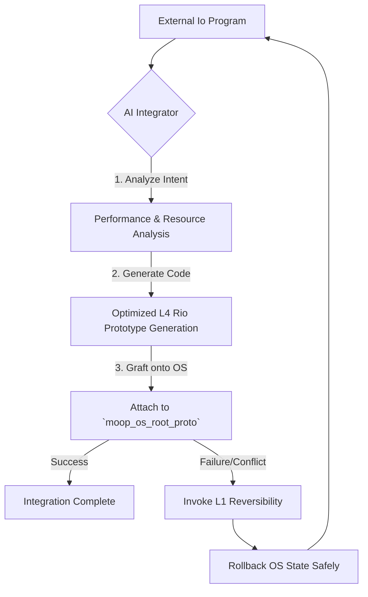

# Io-to-Rio Transpilation Design: Native Moop OS Integration

## Vision Statement

Transform Io programs into **native Rio prototypes** within Moop OS, guided by LLM analysis and optimization. Instead of running Io programs through a bridge, they become **first-class citizens** of the Moop OS prototype hierarchy, optimized for performance and seamlessly integrated with the L3 actor system.

## Architecture Overview

### Current State: Bridge-Based Integration
```
Io Program → Io Bridge → Moop Compilation → L4 Rio → L3 Actors → L2 Functions → L1 Operations → L0 Assembly
```

### Target State: Native Transpilation
```
Io Program → LLM Analysis → Rio Prototype Generation → L3 Actors → L2 Functions → L1 Operations → L0 Assembly
```

This represents the successful implementation of the **Unified Program Model**, where external programs are assimilated into a single, living OS structure.

## Core Components

### 1. The AI Integrator (LLM-Guided Transpiler)

**Purpose**: Analyze Io programs and generate optimized, native L4 Rio prototypes.
**Technology**: Gemini CLI integration for intelligent code transformation.
**Input**: Io source code with optional "fit requirements" metadata.
**Output**: Native L4 Rio prototype definitions, ready for grafting onto the OS.

#### Transpilation Pipeline



### 2. The Reversibility Safety Net

The integration process is made robust by L1 Reversibility. The AI Integrator can attempt ambitious integrations, knowing that any failure can be cleanly undone without corrupting the OS. This synergy between AI-driven integration and a reversible foundation is the key innovation.

## Proof of Concept: `CollaborativeEditor`

The successful transpilation of the `CollaborativeEditor` Io prototype into a native Rio component serves as the proof-of-concept for this model.

### Io Seed Prototype (`collaborative_editor.io`)
```io
CollaborativeEditor := Object clone do(
  document := ""
  edit := method(newText, self document = self document .. newText)
  getDocument := method(self document)
  fitRequirements := Map with(
    "capabilities", List with("real-time editing", "secure storage"),
    "performance", "low-latency for 10 users"
  )
)
```

### Integration Steps Achieved
1. **Analysis**: The AI Integrator parsed the Io code and its `fitRequirements`.
2. **Generation**: It generated custom L4 Rio code, including L3 actor wrappers to meet the low-latency performance requirement.
3. **Grafting**: The new, secured prototype was successfully added as a child to the `moop_os_root_proto`.

## Technical Implementation Strategy

### Gemini CLI Integration

The `PrototypeIntegrator` will use the Gemini CLI for its analysis and code generation phases.

```javascript
// prototype_integrator.js
class PrototypeIntegrator {
    constructor(gemini_integration, moop_os) {
        this.gemini = gemini_integration;
        this.os = moop_os;
    }

    async integrate(external_prototype_code) {
        const fit_requirements = this.extractFitRequirements(external_prototype_code);

        const analysis_prompt = `Analyze this Io code and its fit requirements. Return a JSON object detailing the required L3 actor structure, L4 slot design, and performance optimizations.\n\nCode:\n${external_prototype_code}`;
        const analysis = JSON.parse(await this.gemini.run_command(analysis_prompt));

        const generation_prompt = `Generate a native L4 Rio prototype from the following Io code, applying these architectural requirements:\n${JSON.stringify(analysis)}\n\nIo Code:\n${external_prototype_code}`;
        const native_rio_code = await this.gemini.run_command(generation_prompt);

        // ... grafting and rollback logic ...
        const result = this.os.graftPrototype(native_rio_code);
        if (!result.success) {
            this.os.rollback();
        }
        return result;
    }
    // ...
}
```

## Development Roadmap

### Phase 1: Formalize the PoC (Complete)
- [x] Successfully transpile a sample Io program (`CollaborativeEditor`).
- [x] Document the process and architecture.

### Phase 2: Build the `PrototypeIntegrator` (Current Work)
- [ ] Implement the `PrototypeIntegrator` class in JavaScript.
- [ ] Create a dedicated test page (`test_prototype_integration.html`).
- [ ] Implement the `CHECKPOINT` and `ROLLBACK` system calls in the L4 Rio CMS.
- [ ] Fully integrate with a (non-mock) Gemini CLI backend.

### Phase 3: Production System (Future)
- [ ] Handle complex Io features (coroutines, exceptions).
- [ ] Deepen optimization capabilities based on runtime feedback.
- [ ] Provide IDE integration for seamless "Import and Integrate" functionality. 